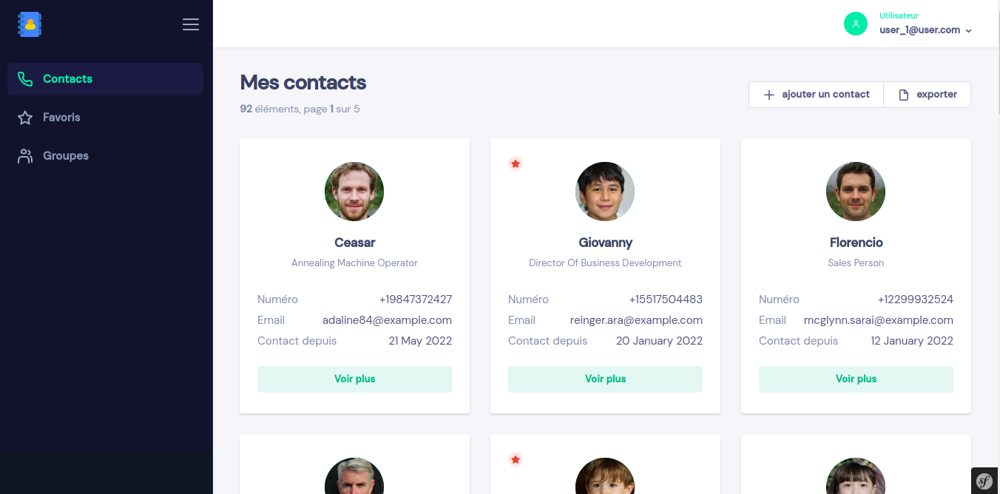
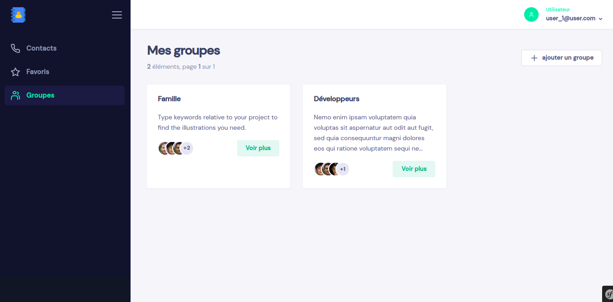
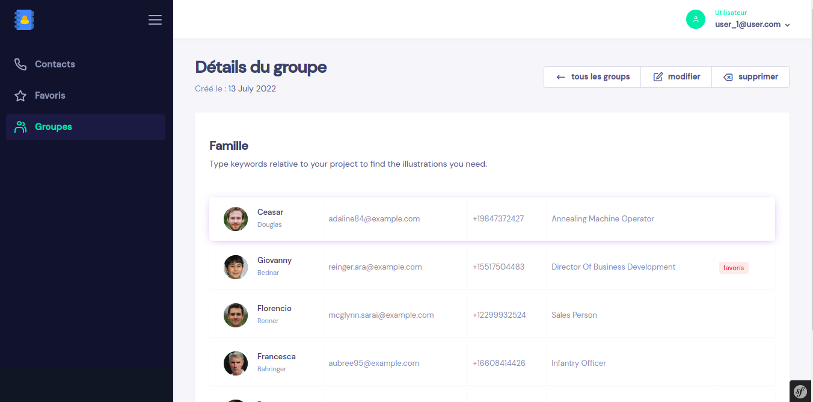

<p align="center">

</p>

# Projet annuel : Carnet d’adresse électronique

[](https://creativecommons.org/licenses/by/4.0/)
[](https://github.com/bernard-ng/contact-book-php/actions/workflows/lint.yaml)

Un carnet d'adresses est un carnet ou une base de données dans lequel son utilisateur note les informations nécessaires pour contacter les personnes qu'il fréquente. Un réseau de contact est une des choses les plus importantes pour qui que ce soit et avoir ses contacts uniquement sur son téléphone est un risque, car le seul téléphone devient un point de défaillance unique.

C’est pourquoi notre carnet d’adresse de notre projet annuel sauvegarde les données sur un serveur distant dans le cloud ce qui permet d’ajouter, modifier, rechercher, supprimer depuis n’importe quel appareil connecté aussi d’exporter ou importer les contacts vers un autre appareil. L’application permet aussi de regrouper les contacts et une possibilité d’avoir des contacts favoris.

L'objectif est de permettre à l'utilisateur de retrouver ses contacts le plus rapidement possible, avoir accès à ses contacts peu importe l’heure et où il se trouve, sécuriser toutes ses informations personnelles avec une authentification

## Attributions des rôles

- Kahindo Mutsunga Charline (Algorithmique)
- Bukasa Kamwanga Patrick (UI/UX Design)
- Tshabu Ngandu Bernard (Backend)


## Lancer l'application (environnement de dev)
L'application utilise un ensemble de technologie pour fonctionner, afin d'éviter les problèmes de compatibilité que l'on peut avoir sur différent environnement, nous avons utilisé **Docker**

```bash
# Téléchargement des sources
git clone https://github.com/bernard-ng/contact-book-php contacts
cd contacts

# installation et mise en place
make install

# création de données de test
make seed

# lancer l'application (localhost:8000)
make dev
```

## Screenshots





